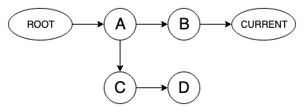
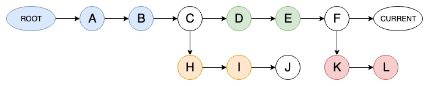
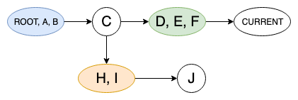

# Index

- [Index](#index)
- [Do it yourself](#do-it-yourself)
  - [Lexem analyzer](#lexem-analyzer)
    - [Parser](#parser)
    - [Memory definition](#memory-definition)
    - [Garbage collector](#garbage-collector)
      - [Temporal garbage](#temporal-garbage)
      - [Spatial garbage](#spatial-garbage)
    - [Backtracking system](#backtracking-system)
    - [Analysis](#analysis)

# Do it yourself

This series of documents explain how to implement an analyzer for the Lexem language.

## Lexem analyzer

A Lexem analyzer parses the Lexem code and interpretes it. You can implement your own Lexem interpreter if you need to embed it in your project, but if you have internet connection or you want to manually compile, you can use the REPL and API of [lexemlang.org](https://lexemlang.org).

If you still require to embed it in your project, follow these steps:

1. The very first thing you have to do is create a parser for Lexem to get the Lexem's code in a way you can understand, like an [AST](https://en.wikipedia.org/wiki/Abstract_syntax_tree) tree.
2. Implement a memory system including a garbage collector to manage the internal data of Lexem.
3. Implement and manage the backtracking system.
4. Execute the analysis using the parsed AST.
5. Return the results as a tree structure of nodes. Normally `json`, `xml` or any other format you want.
6. Finally, if your project is public, tell us about your project through Github or our mail support@lexemlang.org tto include it in our official list of implementations :).

> **Note**: to be recognized as a valid Lexem analyzer you must pass a set of tests (see `WIP`).

### Parser

The implementation of the parser is not opinionated, create it in whatever way you want but bear in mind to follow the official [grammar](../grammar/README.md) to parse exactly the same code.

### Memory definition

`WIP`

### Garbage collector

We do not want to force you imposing a way of collecting the unreferenced objects (garbage) so this section depends on you to create
a good implementation for your interpreter but we want to give some advises.

#### Temporal garbage

Because the backtracking requires to keep snapshots of the memory, you probably will need to collect them at any moment. This is performed collapsing the snapshots, i.e. joining near snapshots into just only one to free the memory, but only if they do not have more than one _next_ reference.

There are three ways to perform the collapsing:

1. **Forward**: in a group of collapsible snapshots raise all the items, i.e. move them from the older snapshot to the newer one. This is suitable when you do not care about spatial garbage and when newer snapshots have more items than the older ones.
2. **Backward**: the same as _Forward_ but dropping all the items, i.e. moving them from the newer to the older snapshot. This is also suitable when you do not care about spatial garbage and when older snapshots have more items than the newer ones.

> Any of the above methods can be used in any case, but one is more suitable than the others in certain cases.

3. **Total**: finally, this method is suitable to collect all spatial and temporal garbage. The idea is to use a version of a _mark and sweep_ collector called _mark and rise_. In this method you must raise all the living objects into the newer snapshot using a _mark_ phase like the one in the _mark and sweep_ algorithm. Finally, when all living objects are raised, only the dead objects stay in the older snapshots and you can remove those.

    > Use this method only when you can collapse the root snapshot because it will probably increase the amount of memory.

> **DO NOT** use any of these methods with the current snapshot, only with previous ones due to those are immutable.

For example, if the progress of the analysis ended with a memory like this:

It can be collapsed to:

The red section is removed because there is no active branch there. That's why the `F` snapshot joins to `D, E`.

#### Spatial garbage

Apart from the Lexem-specific temporal garbage, as any other programming language Lexem generates a spatial garbage i.e. unreferenced objects in the current snapshot.

You should not use any of the temporal methods described above with the current snapshot because in this case, they implied a _stop-the-world_ collector.

Thus, for spatial garbage we recommend to use a _reference counting collector_ to immediately remove acyclic objects and implement a _cyclic collector_ for cycles or leave them to the temporal collector.

### Backtracking system

The backtracking system must be implemented using the memory model of snapshots i.e. when the path bifurcates and creates two possible paths, the memory model must create a snapshot for both of them leaving the current one to the past.

With this system the program can return to any previous state to continue with its execution in another path. When this occurs, the memory must mark the past snapshots to be collected, due to every of its paths (but one) has been already tried.

### Analysis

Some parts of the interpreter are not opinionated to let developers to research and invent new ways to do them in order to improve Angmar itself and other implementations.

Because of that, the analysis itself is not ruled and you can implement it the way you want.
